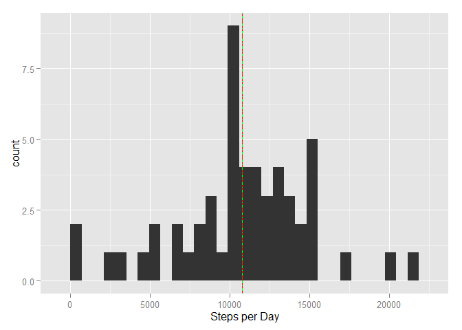
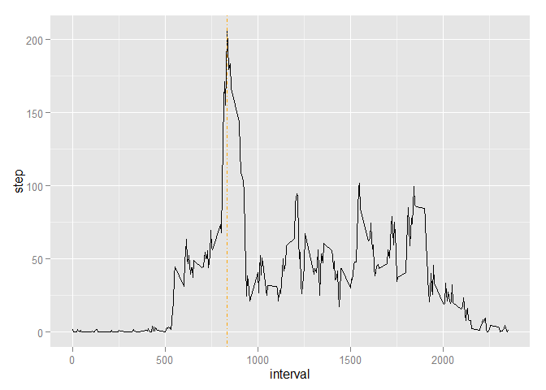
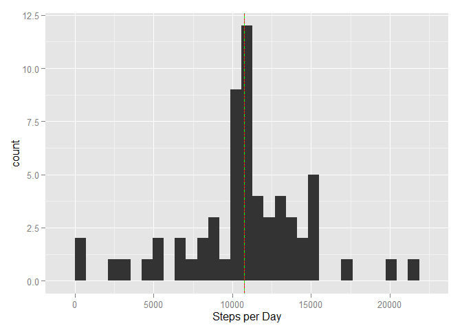
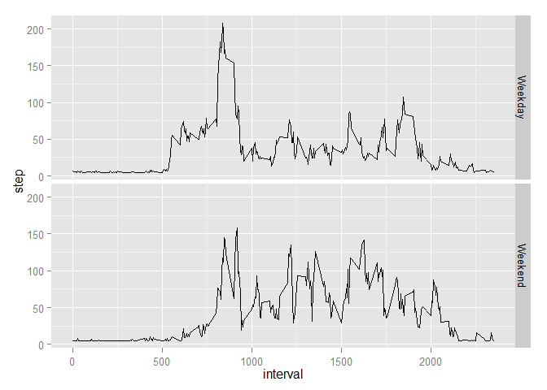

Reproducible Research: Peer Assessment 1
==========================================

## Loading and preprocessing the data

```r
library(ggplot2)
mydata <- read.csv("activity.csv", sep = ",", na.strings = "NA", stringsAsFactors = FALSE, header = TRUE)
mydata$date <- as.Date(mydata$date, "%Y-%m-%d")
```


## What is mean total number of steps taken per day?

```r
StepPerDay <- tapply(mydata$steps, mydata$date, sum)
qplot(StepPerDay) + geom_vline(xintercept=mean(StepPerDay, na.rm=TRUE), color="red") + geom_vline(xintercept=median(StepPerDay, na.rm=TRUE), color="green" , lty=4) + xlab("Steps per Day")
```

```
## stat_bin: binwidth defaulted to range/30. Use 'binwidth = x' to adjust this.
```

 


```r
mean(StepPerDay, na.rm=TRUE)
```

```
## [1] 10766
```


```r
median(StepPerDay, na.rm=TRUE)
```

```
## [1] 10765
```


## What is the average daily activity pattern?

```r
omit <- na.omit(mydata)
intervals <- tapply(omit$steps, omit$interval, mean)
mydata2 <- data.frame(step=intervals, interval=as.numeric(rownames(intervals)))
qplot(interval, step, data=mydata2, group=1, geom='line') + geom_vline(xintercept=mydata2[mydata2$step == max(mydata2$step),2], color="orange", lty=4)
```

 


```r
max <- mydata2[mydata2$step == max(mydata2$step), 2]
```

*The time interval with the maximum average number of steps is 835, that is the 5-minutes interval at 8:35 am.*


## Imputing missing values
*Fill in the missing values with the mean*


```r
sum(!complete.cases(mydata))
filled = data.frame(mydata)
filled$steps[is.na(filled$steps)] <- mean(filled$steps, na.rm=TRUE)
StepPerDay <- tapply(filled$steps, filled$date, sum)
qplot(StepPerDay) + geom_vline(xintercept=mean(StepPerDay, na.rm=TRUE), color="red") + geom_vline(xintercept=median(StepPerDay, na.rm=TRUE), color="green", lty=4) + xlab("Steps per Day")
```

```
## stat_bin: binwidth defaulted to range/30. Use 'binwidth = x' to adjust this.
```

 

*Re-compute the mean and median*


```r
mean(StepPerDay, na.rm=TRUE)
```

```
## [1] 10766
```


```r
median(StepPerDay, na.rm=TRUE)
```

```
## [1] 10766
```

## Are there differences in activity patterns between weekdays and weekends?

```r
weekends <- function(d){
        if (weekdays(d) %in% c("Saturday", "Sunday")) {
                "weekend"
                } else {
                        "weekday"
                        }
        }
filled$weekday <- sapply(filled$date, weekends)
wkd <- filled[filled$weekday == "weekday",]
intervals_wkd <- tapply(wkd$steps, wkd$interval, mean)
mydata3 <- data.frame(step=intervals_wkd, interval=as.numeric(rownames(intervals_wkd)), wkd="Weekday")
wknd <- filled[filled$weekday == "weekend",]
intervals_wknd <- tapply(wknd$steps, wknd$interval, mean)
mydata4 <- data.frame(step=intervals_wknd, interval=as.numeric(rownames(intervals_wknd)), wkd="Weekend")
wk <- rbind(mydata3,mydata4)  
qplot(interval, step, data=wk, group=1, geom='line', facets=wkd~.)
```

 
